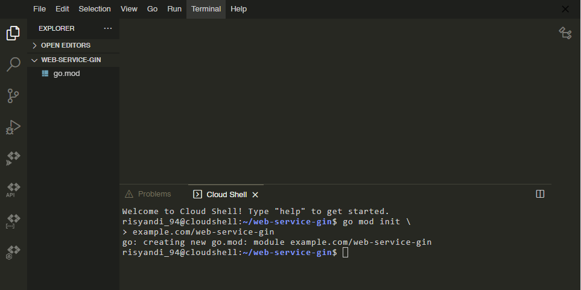
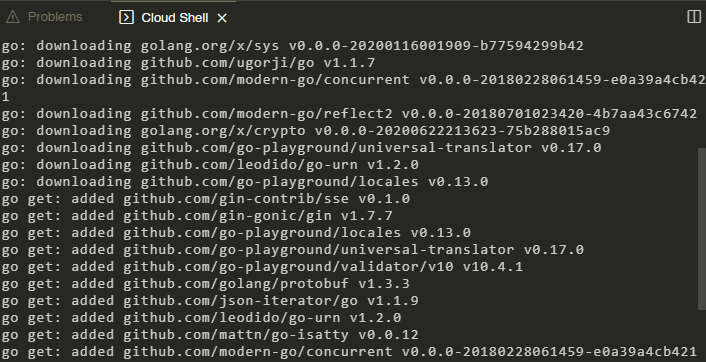

## Membuat Simple Web Services Go dan Gin Framework
1. Buat folder baru dengan nama "web-service-gin"  
2. Buka terminal didalam folder yang sebelumnya dibuat.  
 Lalu ketikan perintah pada terminal untuk membuat modul yang akan me manage dependency. Caranya sebagai berikut:   
	- `$ go mod init \`   
Lalu enter dan masukanpath modul kamu   
	- `$ example.com/web-service-gin`  
Lalu enter dan file go berekstensi ***.mod*** akan dibuat, dan tampilan hasil nya akan seperti ini  

          
        *gambar 1 : go mod init dan membuat path pada modul*  

        
        *gambar 2 : go mod init success*  

3. Buat file baru dengan nama ***main.go***
```go
package main

import (
	"net/http"

	"github.com/gin-gonic/gin"
)

// album represent data about a record album
type album struct {
	ID     string  `json:"id"`
	Title  string  `json:"title"`
	Artist string  `json:"artist"`
	Price  float64 `json:"price"`
}

// album slice to seed record album data
var albums = []album{
	{ID: "1", Title: "Blue Train", Artist: "john coltrane", Price: 56.99},
	{ID: "2", Title: "jeru", Artist: "gerry mulligan", Price: 17.99},
	{ID: "3", Title: "Sarah Vaughan and clifford brown", Artist: "sarah vaughan", Price: 39.99},
}

// getAlbums responds with the list of all album
func getAlbums(c *gin.Context) {
	c.IndentedJSON(http.StatusOK, albums)
}

// postAlbums adds an album from JSON received in the request body.
func postAlbums(c *gin.Context) {
        var newAlbum album

        // Call BindJSON to bind the received JSON to
        // newAlbum.
        if err := c.BindJSON(&newAlbum); err != nil {
                return
        }

        // Add the new album to the slice.
        albums = append(albums, newAlbum)
        c.IndentedJSON(http.StatusCreated, newAlbum)
}

// getAlbumByID locates the album whose ID value matches the id
// parameter sent by the client, then returns that album as a response.
func getAlbumByID(c *gin.Context) {
        id := c.Param("id")

        // Loop over the list of albums, looking for
        // an album whose ID value matches the parameter.
        for _, a := range albums {
                if a.ID == id {
                        c.IndentedJSON(http.StatusOK, a)
                        return
                }
        }
        c.IndentedJSON(http.StatusNotFound, gin.H{"message": "album not found"})
}

func main() {
        // initialization router default
	router := gin.Default()
	router.GET("/albums", getAlbums)
        router.GET("/albums/:id", getAlbumByID)
	router.POST("/albums", postAlbums)

        // router run on port 8080
	router.Run("localhost:8080")
}

```
4. Jika sudah membuat beberapa yang dibutuhkan dan membuat router untuk mengalamatkan service yang dibutuhkan.  
Ketikan perintah `$ go get .` untuk menginstall modul dependency gin yang diperlukan. setelah proses download dan penambahan modul selesai.

5. Lalu jalankan perintah berikut ini untuk menjalankan server.  
    - `$ go run .` atau `$ go run main.go`

6. Menjalankan method service yang sebelumnya dibuat dengan metode **POST** menggunakan curl dengan mengetik perintah berikut:  
    - `$ curl -i http://localhost:8080/albums`
    - `$ curl http://localhost:8080/albums \
    --include --header \
    "Content-Type: \
    application/json" --request \
    "POST" --data '{"id": \
    "4","title": "The Modern Sound \
    of Betty Carter","artist": \
    "Betty Carter","price": 49.99}'`